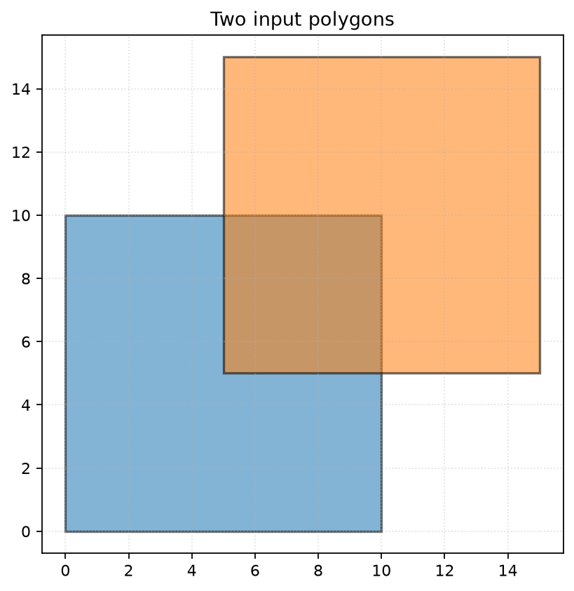
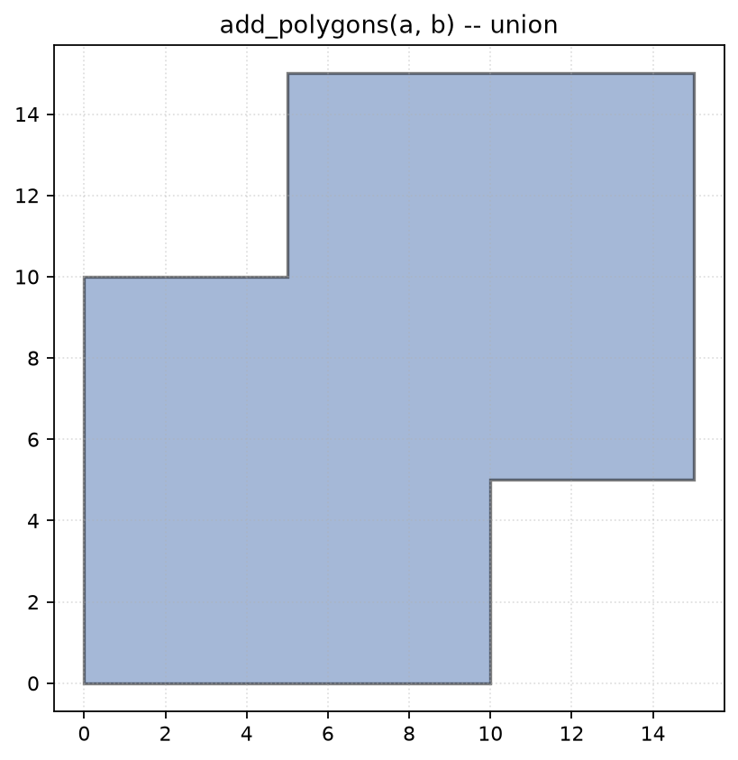
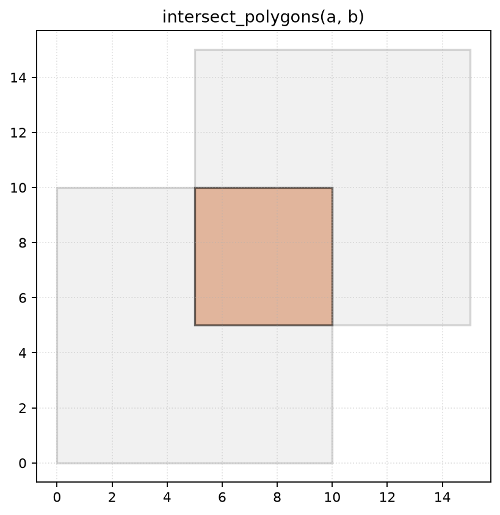
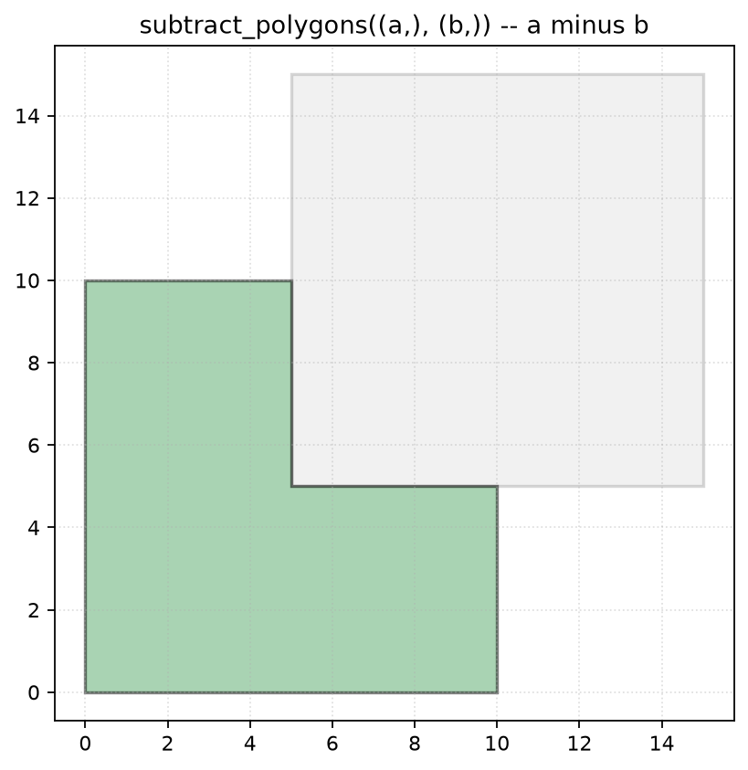
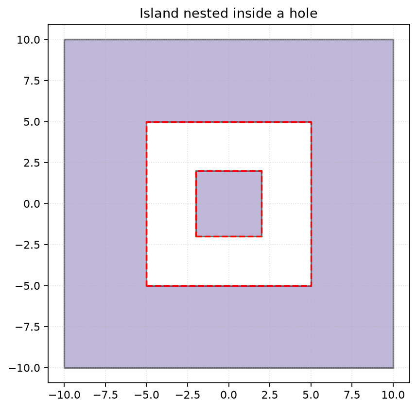
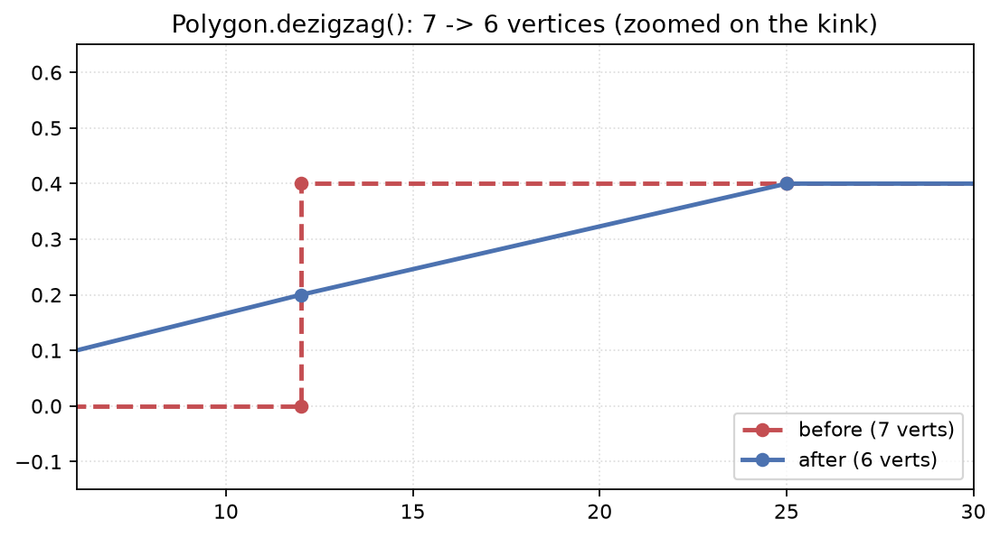
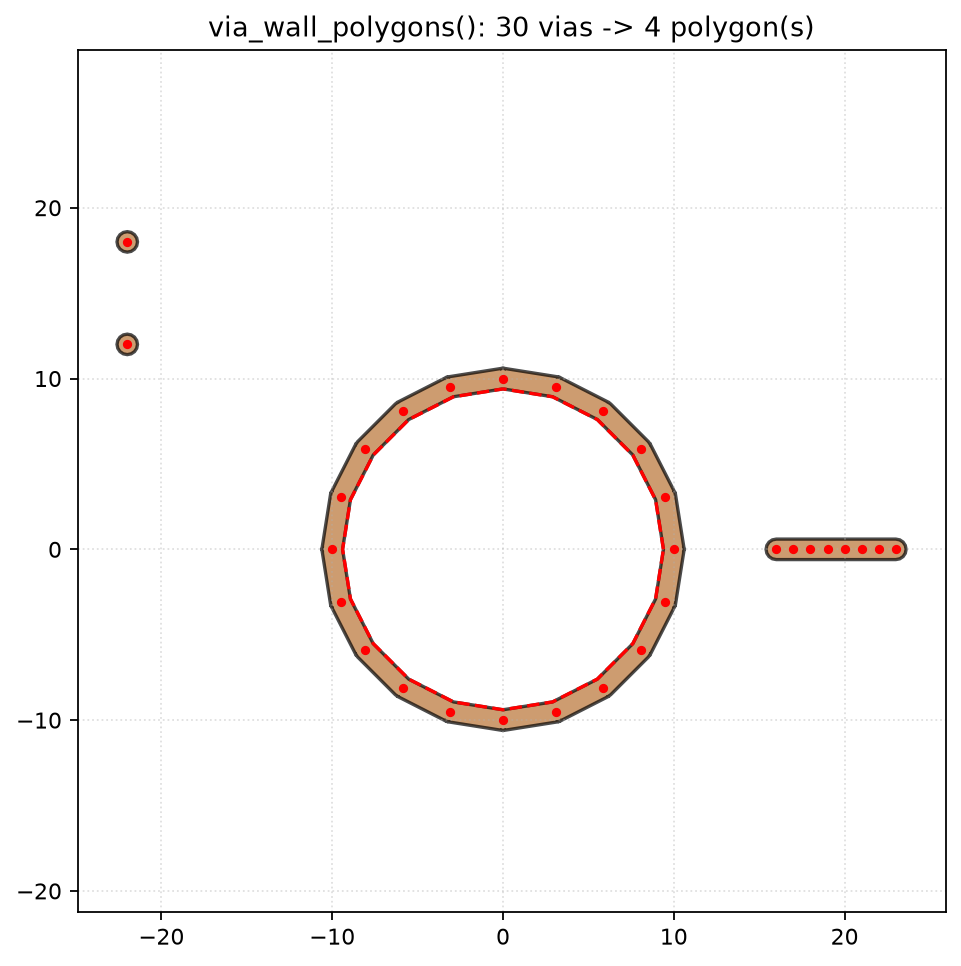

# emcad demo

A visual tour of the polygon kernel, rendered with `emcad.plot.GeometryPlotter`.
Every image here is generated straight from the code shown above it -- see
[`docs/generate_demo_images.py`](./docs/generate_demo_images.py) to
regenerate them yourself, or as a working reference for `GeometryPlotter`'s
API.

## Boolean operations

Two overlapping squares:

```python
import emcad as cad

a = cad.Polygon([0, 10, 10, 0], [0, 0, 10, 10])
b = cad.Polygon([5, 15, 15, 5], [5, 5, 15, 15])
```



`add_polygons` -- union:

```python
union = cad.add_polygons(a, b)
```



`intersect_polygons` -- only what's inside both:

```python
inter = cad.intersect_polygons(a, b)
```



`subtract_polygons` -- `a` minus `b`:

```python
diff = cad.subtract_polygons((a,), (b,))
```



All three (and `join_polygons`) are built on the same exact-predicate
arrangement engine, so degenerate cases -- touching edges, T-junctions,
same-side overlaps -- resolve correctly without epsilon-tuning.

## Holes and nested islands

`Polygon.holes` nests arbitrarily deep: a hole can carry its own holes
(islands), which can carry their own holes, and so on. Every boolean op and
the plotter itself handle that nesting automatically:

```python
outer = square(0, 0, 20)
hole = square(0, 0, 10)
island = square(0, 0, 4)

plane = cad.subtract_polygons((outer,), (hole,))[0]
with_island = cad.add_polygons(plane, island)
```



## `Polygon.dezigzag()`: cleaning up tessellation artifacts

A union of many round-capped trace segments (common when buffering ODB++
Line/Arc features into filled strokes) tends to leave short "kink" steps
where a tessellated circle's polygon approximation slightly misses the
tangent point it should cleanly meet a straight segment at. `dezigzag()`
collapses those, in place, without ever being able to turn a valid polygon
invalid (see its docstring for the exact safety guarantee):

```python
poly.dezigzag(max_kink_length=1.0, max_angle_deg=25.0, min_neighbor_factor=2.0)
```



The dashed red line is the untouched original -- a hard right-angle step
sandwiched between two long, nearly-parallel runs. The solid blue line is
the same polygon after `dezigzag()`: one clean diagonal, one fewer vertex.

## `via_wall_polygons()`: via fences without meshing every via

For a dense via fence, meshing every individual via as its own cylinder is
often more detail than an EM simulation needs. `viaconnect.via_wall_polygons`
takes a cloud of via coordinates and derives a thickened "wall" polygon
directly from the via network's own connectivity graph -- closed loops
become holes, straight runs become single connecting segments, and isolated
vias are kept as their own circles:

```python
from emcad.viaconnect import via_wall_polygons

walls = via_wall_polygons(via_xy, max_dist=3.5, thickness=1.2, circle_segments=16,
                           include_isolated_vias=True)
```



30 via coordinates in, 4 polygons out: the closed ring fused into one
annulus (hole correctly punched, not just visually -- `polygon.holes` has a
real entry), the straight run fused into one connecting strip, and the two
isolated vias kept as their own circles.

## Parsing a real board

See the [README](./README.md#quick-start-parsing-an-odb-board) for the
`PCBView`/`ODBImport` side of things -- turning an actual ODB++ board into
these same kinds of polygons, Z-stacked and boolean-unified per layer.
